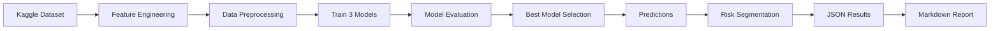

# 🚀 Phân Tích và Dự Đoán Churn Khách Hàng trong Doanh Nghiệp SaaS

## 📚 Thông Tin Môn Học

- **Tên môn học**: Học Máy (Machine Learning)
- **Mã học phần**: CO3117
- **Lớp**: DT01_251
- **Học kỳ**: Học kỳ I
- **Năm học**: 2024-2025

## 👨‍🏫 Giảng Viên Hướng Dẫn

- **Họ và tên**: Trương Vĩnh Lân
- **Đơn vị**: Trường Đại học Bách Khoa - ĐHQG TP.HCM

## 👥 Thành Viên Nhóm

| STT | Họ và Tên | Mã Số Sinh Viên | Email |
|-----|-----------|-----------------|-------|
| 1   | Phan Thị Thuỳ Anh | 2433103 | anh.phantt@hcmut.edu.vn |
| 2   | Nguyễn Thị Hồng Phúc | 2433190 | phuc.nguyenthihong@hcmut.edu.vn |

## 🎯 Mục Tiêu Bài Tập Lớn

Dự án này nhằm mục đích:

1. **Phân tích hành vi khách hàng**: Khám phá các yếu tố ảnh hưởng đến quyết định rời bỏ dịch vụ (churn) của khách hàng SaaS
2. **Xây dựng mô hình dự đoán**: Phát triển và so sánh 3 mô hình Machine Learning để dự đoán churn:
   - Logistic Regression
   - Random Forest Classifier
   - Gradient Boosting Classifier
3. **Đánh giá hiệu suất**: So sánh các mô hình dựa trên các metrics: Accuracy, Precision, Recall, F1-Score, AUC-ROC
4. **Phân tích Feature Importance**: Xác định các yếu tố quan trọng nhất ảnh hưởng đến churn
5. **Phân khúc rủi ro**: Xây dựng hệ thống phân loại khách hàng theo mức độ rủi ro (High/Medium/Low)
6. **Đề xuất giải pháp**: Cung cấp khuyến nghị hành động để giảm tỷ lệ churn

## 📋 Tổng Quan Kỹ Thuật

Project này xây dựng và so sánh 3 mô hình Machine Learning để dự đoán khả năng khách hàng rời bỏ dịch vụ (churn):
- **Logistic Regression**
- **Random Forest Classifier**
- **Gradient Boosting Classifier**

## 🎯 Kết Quả Chính

- ✅ **Best Model**: Logistic Regression (AUC-ROC: 0.5711)
- ✅ **Dataset**: 500 khách hàng, 40 features
- ✅ **Churn Rate**: 22%
- ✅ **High-Risk Customers**: 1 khách hàng cần intervention ngay

## 📂 Cấu Trúc Thư Mục Dự Án

```
saas_assignment/
├── README.md                        # File tài liệu hướng dẫn (bạn đang đọc file này)
├── modules/                         # Thư mục chứa code và kết quả
│   ├── saas.py                      # Script phân tích chính
│   ├── requirements.txt             # Danh sách thư viện cần thiết
│   └── analysis_results.json        # Kết quả phân tích (auto-generated)
├── notebooks/                       # Thư mục chứa notebook và visualizations
│   ├── Học_máy_Assignment.ipynb     # Jupyter Notebook chính
│   ├── Figure_1.png                 # Model Performance Comparison
│   ├── Figure_2.png                 # Feature Importance Analysis
│   └── Figure_3.png                 # Risk Segmentation Charts
└── reports/                         # Thư mục chứa báo cáo
    └── Báo cáo Môn Học máy_Phân Tích và Dự Đoán Churn Khách Hàng.pdf
```

## 🚀 Hướng Dẫn Chạy Notebook

### Yêu Cầu Hệ Thống

- **Python**: 3.8 trở lên (khuyến nghị Python 3.10+)
- **RAM**: Tối thiểu 4GB
- **Dung lượng**: ~500MB cho dữ liệu và thư viện

### Yêu Cầu Thư Viện

Dự án sử dụng các thư viện Python sau:

```txt
pandas>=2.0.0              # Xử lý và phân tích dữ liệu
numpy>=1.24.0              # Tính toán số học
matplotlib>=3.7.0          # Vẽ biểu đồ
seaborn>=0.12.0           # Visualization nâng cao
scikit-learn>=1.3.0       # Machine Learning models
kagglehub>=0.2.0          # Tải dữ liệu từ Kaggle
python-docx>=1.0.0        # Tạo file Word (optional)
markdown>=3.5.0           # Xử lý Markdown (optional)
```

### Cài Đặt

#### Bước 1: Clone Repository (nếu cần)

```bash
git clone https://github.com/felicianguyenmt/saas_assignment.git
cd saas_assignment/modules
```

#### Bước 2: Tạo Virtual Environment (Khuyến nghị)

```bash
# Tạo virtual environment
python3 -m venv venv

# Kích hoạt virtual environment
# Trên macOS/Linux:
source venv/bin/activate
# Trên Windows:
# venv\Scripts\activate
```

#### Bước 3: Cài Đặt Thư Viện

```bash
pip install -r requirements.txt
```

Hoặc cài đặt thủ công:

```bash
pip install pandas numpy matplotlib seaborn scikit-learn kagglehub
```

### Cách Tải Dữ Liệu

Dữ liệu được tự động tải từ Kaggle thông qua `kagglehub`. Khi chạy script, dữ liệu sẽ được tải về tự động:

```python
# Trong saas.py
import kagglehub
path = kagglehub.dataset_download("safrinrisk/saas-customer-churn-analysis")
```

**Lưu ý**: 
- Dữ liệu sẽ được cache trong thư mục `~/.cache/kagglehub/`
- Không cần API key cho dataset public
- Kết nối internet cần thiết cho lần chạy đầu tiên

### Chạy Phân Tích

#### Option 1: Chạy Script Python (Khuyến nghị)

```bash
# Di chuyển vào thư mục modules
cd modules

# Chạy phân tích
python3 saas.py
```

#### Option 2: Chạy Từng Bước trong Python Interactive

```python
# Khởi động Python
python3

# Import và chạy
>>> exec(open('saas.py').read())
```

### Kết Quả

Sau khi chạy, bạn sẽ thấy:
- File `analysis_results.json` chứa kết quả phân tích
- 3 biểu đồ hiển thị trên màn hình (hoặc lưu trong thư mục notebooks/)
- In ra console: Model performance metrics và top high-risk customers

## 📊 Outputs và Kết Quả

### 1. Jupyter Notebook (Google Colab) 📓
**Link**: [https://colab.research.google.com/drive/1s0nkWXOEhT3G00c8OQJ18iXZly6v0kKF?usp=sharing](https://colab.research.google.com/drive/1s0nkWXOEhT3G00c8OQJ18iXZly6v0kKF?usp=sharing)

Notebook tương tác bao gồm:
- 📊 Code phân tích đầy đủ
- 📈 Visualizations tương tác
- 📝 Giải thích chi tiết từng bước
- 🎯 Kết quả và insights

### 2. Visualizations (Biểu Đồ) 🎨
Lưu trong thư mục `notebooks/`:
- **Figure_1.png**: Model Performance Comparison
- **Figure_2.png**: Feature Importance Analysis  
- **Figure_3.png**: Risk Segmentation Charts

### 3. analysis_results.json 📋
File JSON chứa tất cả kết quả phân tích:
- Model performance metrics
- Confusion matrices
- Feature importance
- Risk segmentation
- Top high-risk customers

### 4. Báo Cáo PDF 📄
Báo cáo học thuật đầy đủ bằng tiếng Việt:
- Tổng quan về bài toán Churn Prediction
- Phân tích khám phá dữ liệu (EDA)
- Thiết kế và triển khai các mô hình ML
- Đánh giá và so sánh kết quả
- Kết luận và hướng phát triển

**Location**: `reports/Báo cáo Môn Học máy_Phân Tích và Dự Đoán Churn Khách Hàng trong Doanh Nghiệp SaaS bằng Machine Learning.pdf`

## 📈 Model Performance

| Model | Accuracy | Precision | Recall | F1-Score | AUC-ROC |
|-------|----------|-----------|--------|----------|---------|
| **Logistic Regression** | 0.7800 | 0.5000 | 0.0455 | 0.0833 | **0.5711** ✅ |
| Random Forest | 0.7800 | 0.0000 | 0.0000 | 0.0000 | 0.5443 |
| Gradient Boosting | 0.7800 | 0.5000 | 0.0909 | 0.1538 | 0.4901 |

## 🔑 Top Features

### Random Forest - Top 5
1. avg_error_rate (0.0508)
2. avg_arr (0.0427)
3. avg_first_response_time (0.0411)
4. avg_usage_duration (0.0405)
5. days_since_signup (0.0401)

### Gradient Boosting - Top 5
1. avg_error_rate (0.1065)
2. avg_first_response_time (0.0701)
3. avg_resolution_time (0.0687)
4. avg_usage_duration (0.0553)
5. total_usage_count (0.0482)

## 🎯 Risk Segmentation

| Risk Level | Count | Actual Churn Rate |
|------------|-------|-------------------|
| High       | 1     | 100.0% |
| Medium     | 88    | 22.7% |
| Low        | 411   | 19.7% |

## 💡 Key Insights

1. **Error Rate** là feature quan trọng nhất - khách hàng gặp nhiều lỗi có xu hướng churn cao
2. **Support Response Time** ảnh hưởng lớn - thời gian phản hồi chậm tăng nguy cơ churn
3. **Usage Duration** - khách hàng ít sử dụng sản phẩm có nguy cơ cao
4. **Financial Metrics** (MRR/ARR) - khách hàng revenue thấp dễ churn hơn

## 📚 Technologies Used

- **Python 3.13**
- **pandas** - Data manipulation
- **numpy** - Numerical operations
- **scikit-learn** - Machine Learning
- **matplotlib & seaborn** - Visualization
- **kagglehub** - Dataset download

## 🔄 Workflow



## 📄 Báo Cáo và Tài Liệu

### Báo Cáo PDF

📥 **Download báo cáo đầy đủ**: [Báo cáo Môn Học máy - Phân Tích và Dự Đoán Churn Khách Hàng](https://github.com/felicianguyenmt/saas_assignment/blob/main/reports/B%C3%A1o%20c%C3%A1o%20M%C3%B4n%20H%E1%BB%8Dc%20m%C3%A1y_Ph%C3%A2n%20T%C3%ADch%20v%C3%A0%20D%E1%BB%B1%20%C4%90o%C3%A1n%20Churn%20Kh%C3%A1ch%20H%C3%A0ng%20trong%20Doanh%20Nghi%E1%BB%87p%20SaaS%20b%E1%BA%B1ng%20Machine%20Learning.pdf)

Báo cáo bao gồm:
- Tổng quan về bài toán Churn Prediction
- Phân tích khám phá dữ liệu (EDA)
- Thiết kế và triển khai các mô hình ML
- Đánh giá và so sánh kết quả
- Kết luận và hướng phát triển

### Google Colab Notebook

🔗 **Chạy trực tiếp trên Colab**: [https://colab.research.google.com/drive/1s0nkWXOEhT3G00c8OQJ18iXZly6v0kKF?usp=sharing](https://colab.research.google.com/drive/1s0nkWXOEhT3G00c8OQJ18iXZly6v0kKF?usp=sharing)

**Ưu điểm khi dùng Colab**:
- Không cần cài đặt môi trường local
- Chạy miễn phí với GPU/TPU
- Dễ dàng chia sẻ và collaborate

### Code Repository

💻 **GitHub Repository**: [https://github.com/felicianguyenmt/saas_assignment](https://github.com/felicianguyenmt/saas_assignment)

## 📊 Notebooks và Visualizations

### Jupyter Notebook (Google Colab)

Dự án bao gồm một Jupyter Notebook hoàn chỉnh có thể chạy trực tiếp trên Google Colab:

🔗 **[Mở Notebook trên Colab](https://colab.research.google.com/drive/1s0nkWXOEhT3G00c8OQJ18iXZly6v0kKF?usp=sharing)**

**Notebook bao gồm**:
- 📊 Exploratory Data Analysis (EDA) với visualizations
- 🔧 Data Preprocessing và Feature Engineering
- 🤖 Training 3 Machine Learning models
- 📈 Model Evaluation và Comparison
- 🎯 Risk Segmentation và Predictions
- 💡 Insights và Recommendations

**Cách sử dụng**:
1. Click vào link Colab ở trên
2. Chọn "Copy to Drive" để tạo bản sao của bạn
3. Chạy từng cell bằng cách nhấn `Shift + Enter`
4. Hoặc chạy tất cả: `Runtime > Run all`

### Visualizations (Biểu Đồ)

Các biểu đồ phân tích được lưu trong thư mục `notebooks/`:

**Figure_1.png** - Model Performance Comparison
- So sánh AUC-ROC của 3 models
- Confusion matrices
- Performance metrics comparison

**Figure_2.png** - Feature Importance Analysis  
- Top features theo Random Forest
- Top features theo Gradient Boosting
- Feature importance comparison

**Figure_3.png** - Risk Segmentation
- Phân bổ khách hàng theo risk levels
- Actual churn rate by risk group
- High-risk customer identification

### Chạy Local để Tạo Visualizations

```bash
# Chạy script để tạo biểu đồ
python3 saas.py

# Biểu đồ sẽ hiển thị tự động và lưu vào notebooks/
```

## 📖 Hướng Dẫn Xem Báo Cáo

1. **Jupyter Notebook**: Chạy trên [Google Colab](https://colab.research.google.com/drive/1s0nkWXOEhT3G00c8OQJ18iXZly6v0kKF?usp=sharing)
2. **Báo cáo PDF**: Mở file trong thư mục `reports/`
3. **Kết quả phân tích**: Xem file `analysis_results.json` để xem raw data
4. **Visualizations**: Xem các file `.png` trong thư mục `notebooks/`

## 👥 Lộ Trình Phát Triển

### Các Bước Tiếp Theo

1. ✅ Deploy model to production
2. ✅ Integrate với CRM system
3. ✅ Setup real-time alerts cho high-risk customers
4. ✅ A/B test intervention strategies
5. ✅ Measure retention lift

### Đề Xuất Cải Tiến

Để cải thiện project:
1. **Hyperparameter Tuning**: Tối ưu hóa parameters cho từng model
2. **Advanced Models**: Thử nghiệm XGBoost, LightGBM, Neural Networks
3. **Time-series Features**: Thêm features dựa trên xu hướng thời gian
4. **Text Analysis**: Phân tích sentiment từ support tickets
5. **Real-time API**: Xây dựng API để dự đoán real-time
6. **Feature Engineering**: Tạo thêm derived features từ dữ liệu hiện có
7. **Ensemble Methods**: Kết hợp nhiều models để tăng accuracy

## 📞 Liên Hệ

Nếu có thắc mắc hoặc cần hỗ trợ, vui lòng liên hệ qua:
- **GitHub Issues**: [https://github.com/felicianguyenmt/saas_assignment/issues](https://github.com/felicianguyenmt/saas_assignment/issues)
- **Email**: 
  - Phan Thị Thuỳ Anh: anh.phantt@hcmut.edu.vn
  - Nguyễn Thị Hồng Phúc: phuc.nguyenthihong@hcmut.edu.vn

## 🤝 Đóng Góp

Mọi đóng góp và feedback đều được hoan nghênh! Vui lòng:
- Báo lỗi qua Issues
- Đề xuất cải tiến qua Pull Requests
- Chia sẻ ý tưởng mới

## 📝 License

Dự án mang tính chất giáo dục và học tập.

## 🙏 Lời Cảm Ơn

- **Thầy Trương Vĩnh Lân**: Giảng viên hướng dẫn - Hỗ trợ và định hướng trong suốt quá trình thực hiện đồ án
- **Kaggle**: Cung cấp dataset SaaS Customer Churn Analysis
- **Scikit-learn**: Thư viện Machine Learning mạnh mẽ và dễ sử dụng
- **Trường Đại học Bách Khoa - ĐHQG TP.HCM**: Tạo môi trường học tập và nghiên cứu

---

**Môn học**: Học Máy (Machine Learning) - CO3117  
**Lớp**: DT01_251  
**Năm học**: 2024-2025  
**Trạng thái**: ✅ Hoàn thành  
**Địa điểm**: TP. Hồ Chí Minh  
**Cập nhật lần cuối**: Tháng 12/2025

